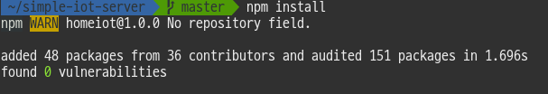
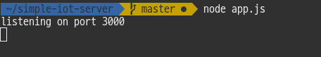
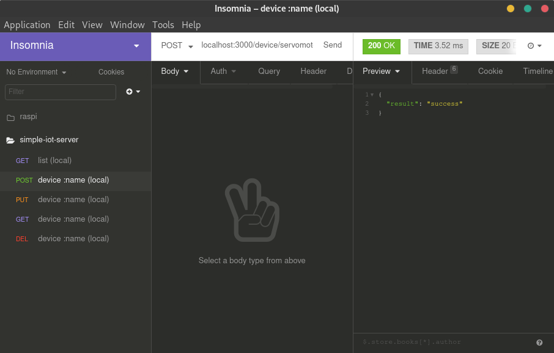
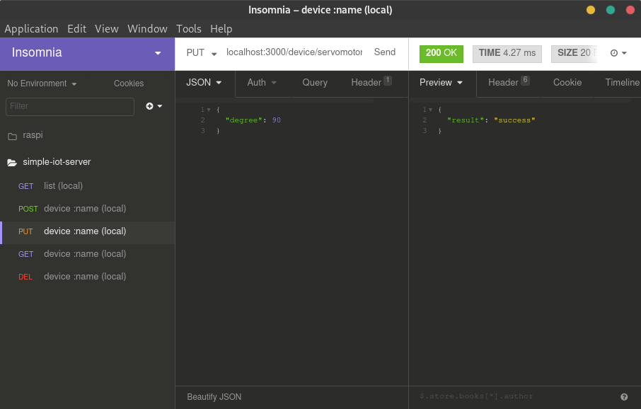

# simple-iot-server

Consult this : https://github.com/dominoyh5/simple-iot-server/wiki

## Start server

```
npm install
```

```
node app.js
```


## Request API

### GET /list
```
localhost:3000/list
```


### POST /device/:name
```
localhost:3000/device/servomotor
```


### PUT /device/:name
```
localhost:3000/device/servomotor
```
```json
{
	"degree": 90
}
```


### GET /device/:name
```
localhost:3000/device/servomotor
```


### DELETE /device/:name
```
localhost:3000/device/servomotor
```

